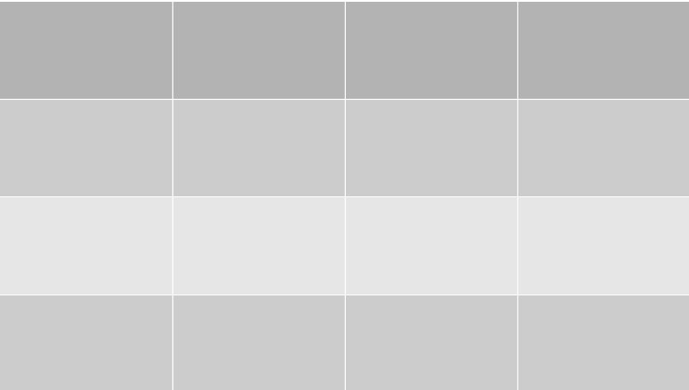
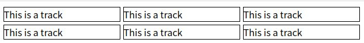

Let's see how to do the grid layout.

## What is the grid layout?

Literally, the grid layout is grid. You can put elemnts on each box which is called "track".



## How to use it?

```html:title=index.html
<body>
  <div class="grid-box">
    <div class="grid-item">Hello</div>
    <div class="grid-item">Hello</div>
    <div class="grid-item">Hello</div>
    <div class="grid-item">Hello</div>
    <div class="grid-item">Hello</div>
    <div class="grid-item">Hello</div>
  </div>
</body>
```

```css:title=style.css
.grid-box {
  width: 480px;
  display: grid;
  gap: 5px;
  grid-template-columns: repeat(3, minmax(200px, 1fr));
}

.grid-item {
  border: 1px solid black;
  width: 100%;
}
```



minmax is for setting min and max width for each track.
"fr" is 1 track width.

Of course, you can change how many times repeating for each device by using media query. So, it is easy to support with responsible design.

```css:title=style.css
@media screen and (max-width: 480px) {
  .grid-box {
    grid-template-columns: repeat(1, minmax(200px, 1fr));
  }
}
```
