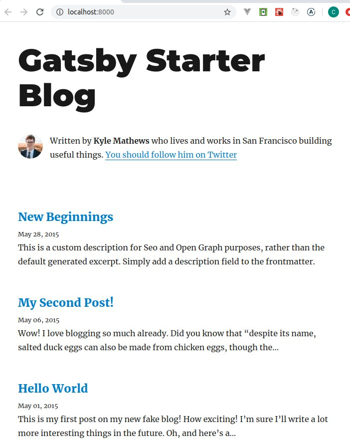
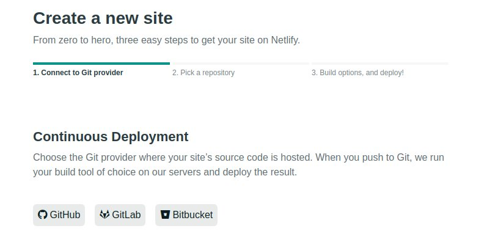
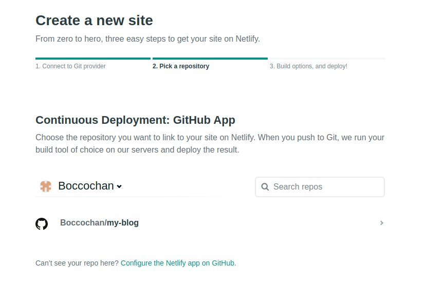
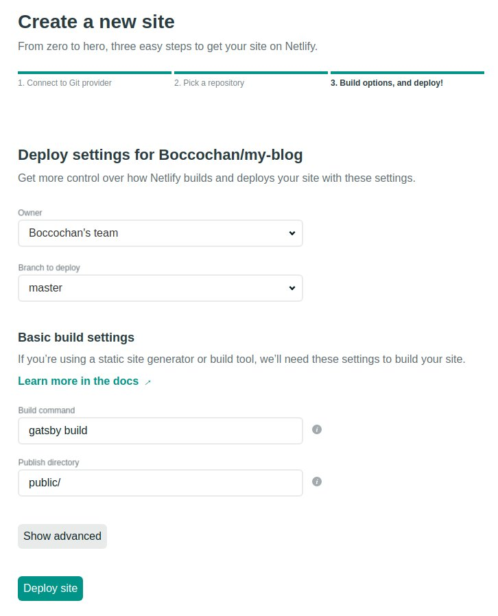
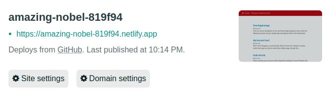

It's easy to deploy Gatsby with Typescript to Netlify. You just need to follow the steps below:

<div class="mt-8 mb-8">

<nav class='blog-nav'> 
  <div class='inner'>
    <p>Index</p>
    <ol class="top-ol">
      <li class="top-li">Getting gatsby cli and starter kid</li>
      <li class="top-li">Creating your repository on Github</li>
      <li class="top-li">Creating your Netlify account and deploying to it</li>
      <li class="top-li">Uploading your blog</li>
      <li class="top-li">Using custom domain</li>
    </ol>
  </div>
</nav>
</div>

## Getting gatsby cli and starter kid

```bash
npm install -g gatsby-cli
```

## Getting starter kit

```bash
gatsby new your-project-name https://github.com/gperl27/Gatsby-Starter-Blog-Typescript
```

If you encounter "Command failed with exit code 1: yarnpkg" error, you should downgrade your node version for now. You can upgrade node version later, don't worry. In my case, node version 10.21.0 worked. Then, please retry to get starter kid.

## Let's check it out.

```bash
cd your-project-name
gatsby develop
```



If you downgraded node version to 10.x and want to use node version over 12.x, you can upgrade node version to 12.x, then:

```bash
rm -rf node_modules yarn.lock
yarn install
gatsby develop
```

## Creating your repository on Github, Gitlab or Bitbucket

You can use Github, Gitlab or Bitbucket to manage and deploy your blog. It's free to use. You need to create your account on one of them first.

This time, I'm using Github here.

### Creating a repository

You need to create repository for your project. If you don't know how to do it, please see [Creating a new repository](https://docs.github.com/en/enterprise/2.13/user/articles/creating-a-new-repository#:~:text=In%20the%20upper%2Dright%20corner,repository%20either%20public%20or%20private.).

### Pushing your source code to the repository

In your project directory,

```bash
git init
git add .
git commit -m "Initial commit"
```

```bash
git remote add origin https://github.com/yourname/your-blog-name.git
git push -u origin master
```

## Creating your Netlify account and deploying to it

You can create your Netlify account [here](https://app.netlify.com/). Then, click "New site from Git button".


I am going to deploy from Github, so I should select Github. But if you are using Gitlab and Bitbucket, you should select them.



Select your repository which you have created.



Click deploy site.



Now, you can see your blog site.



## Uploading your blog

There are already a couple of sample blogs under content/blog. You can add a new blog there. But be careful, you should not delete those sample blogs yet. Probably, it will cause some errors.

I'm going to figure it out.

## Using custom domain

If you want to use your cool URL, you can use it.
I am going to explain how to do it by the other blog post. Coming soon!
