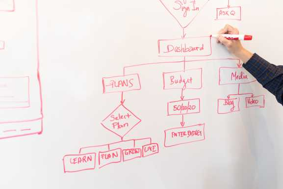

## プログラミングに才能は必要か？どんな才能が必要？

<nav class='blog-nav'> 
  

    
目次

    <ol class="top-ol">
      <li class="top-li">才能は必要です</li>
      <li class="top-li">弱点は克服できる</li>
      <li class="top-li">IQより性格</li>
      <li class="top-li">コツコツ取り組むことが重要</li>
      <li class="top-li">プログラミングが辛いのは人間関係が原因</li>
    </ol>
  

</nav>

プログラミングで悩んでいますか？　職場で打ちのめされていますか？

私はかれこれ15年ほどプログラミングしていますが、同じように悩みましたし今も悩んでいます。

私なりのプログラミングの悩みに対する見解をまとめました。 厳しいことも書いておりますが、本音で書いています。
今後のキャリアを考えるお役に立てればと思います。

## 才能は必要です

結論から言ってしまえば、<strong>才能は必要</strong>です。

若手を何人か見てきましたが、本当に向いていない人もいます。 
あくまで私の経験を元に言わせていただきますと、向いていない人の方が圧倒的に多いように思います。

では、どのような人が向いていないかと言うと。

- 自分で勉強しない人
- 自分から行動しない人
- 嘘をつく、隠し事をする、責任感が薄い人
- 同じ過ちを繰り返す人
- 全体像が見えない人、視野が狭い人
- 物事を順序立てて考えるのが極端に苦手な人

このうちのどれかに強烈にあてはまっている場合は、プログラミング、というより<strong>設計力が求められるような仕事は向いていない</strong>と思います。

素直に他の仕事をした方が幸せになれると思います。

### 自分で勉強しない人

当たり前ですが、<strong>企業は慈善団体ではありません</strong>。 自分でお金使ってでも勉強しようという気持ちがない人はだいたいスキルが低いです。
会社が勉強させてくれない、という言い訳をしたことがある人、黄色信号です。

### 自分から行動しない人

優れた人は自分から仕事を取りに行くか、自分で何か新しいことを始めて自分の価値を示します。 
会社が方針をきめてくれない、上司が指示を出してくれない、という言い訳をして何もしない人を何度も見たことがあります。

そういうタイプは、あまりスキルが上がることはありませんでした。
技術者としても社会人としてもかなり微妙ですね。

### 嘘をつく、隠し事をする、責任感が薄い人

この手のタイプを何度も見たことがあります。問題が起きると他人に責任を押してつけて逃げてしまいます。
政治家であればそれで良いのですが、設計者が逃げるのは最低です。

なぜならば、<strong>問題発生時こそもっとも真価が問われる瞬間</strong>だからです。
まさに問題解決能力を発揮する瞬間ですね。有能な人はこういう時にこそ輝きを放ちます。

逆に、逃げた時点で評価にすら値しない、土俵にすら乗っていない、ということになります。

土俵にすら乗っていない人を、どう周りは評価すべきでしょうか？
評価できません。土俵にいないのだから。

### 同じ過ちを繰り返す人

根本的に同じ問題であるが、表面を見ると違う問題に見える、というものは多々あります。

勘の良い人は、本質的な問題を理解して、他のことに応用しようとします。

勘が悪い人は、表面だけをなぞるので応用がききません。 よって、同じ問題を繰り返します。

こういう人は、そもそも仕事ができないタイプです。プログラマー云々以前の問題です。
単純作業の仕事についた方がよいと思われます。

### 全体像が見えない人、視野が狭い人

プログラマーにもいろいろなレベルがあります。初心者であればシステムの一部だけを任されることもあるでしょう。

しかし、プログラマーとしてスキルアップするには、全体像が見えるかどうかがカギになります。
結局の所、詳細設計は全体が見えた上で行わないと、うまく設計できません。

ここの部分を設計してよ、と言われても全体像が分かってないためにどうしたら良いかわからず、永遠と時間を食った上に完成しない、という自体に見舞われます。

そして、仕事が遅い、と言われて仕事を取り上げれ、仕事ができなヤツ、というレッテルが貼られます。

### 物事を順序立てて考えるのが極端に苦手な人

プログラムというのは、何をいつ、どうするか、という順序を記述していくものです。
当たり前ですが、頭の中でその順序を整理できない人は、まともにプログラムを書くことはできません。

これに関しては、個人差がかなり大きいと思います。
得意な人はより多くのコードがかけるし、苦手な人はより少ないコードを書くことになる、という感じです。

全くできない人もいますが、そういう人は早く諦めた方がよいと思います。

## 弱点は克服できる

自分で勉強でき、主体性があり、責任感があって、全体像が見えて物事を順序立てて考えられる、という才能が必要です。

しかし、すべての事柄に対して、高いレベルで要求を満たす必要があるかというと、そういうわけではありません。

私が思うに、自分の苦手なところを理解し、それを何らかの手で克服することができればOKだと思います。

例えば、私は以下が若干苦手です。

- 自分で勉強する
- 物事を順序立てて考える

私は、人の力を借りることで苦手な部分を克服しています。

つまり、わからなければ聞きますし、プログラムに自信がなければレビューをお願いします。
自分でできそうもなければ、素直に人に任せます。

私は今年38歳になりますが、10歳以上若い人に対し普段から、"さん"をつけて名前を呼び、敬語で話すようにしています。
なぜでしょうか。答えは、質問しやすいようにです。

私の方が役職も年齢も経験も上ですが、私は私より随分と若い人に対し、上司に接するのと同じ態度で接します。
これが私のやり方です。

皆さんも自分の苦手をどう克服するか考えましょう。

## IQより性格

私の考えでは、性格の方が重要だと考えています。

わりと最近は、EQが重要なんて言われていますが、まぁ、性格のことだと思えばよいと思います。

では、なぜでしょうか？

IQが高いに越したことはありません。
しかし、それは普通の人が半年かかることを、IQが高い人は1ヶ月でやってしまう、という話だと思います。

では、その仕事を1ヶ月でやる必要があるのでしょうか？

もちろんプロジェクトによりますが、フリーランスで一人でやっているのではない限り、あまり意味はないでしょう。
もし、チームメンバー全員が高IQ集団だったら意味があるかもしれませんが、そんな状況はほとんどないでしょう。

IQの高い低いにより、できる仕事の大きさが変わるかもしれません。
しかし、<strong>重要なことは仕事の大きさにかかわらず、成果をあげることです</strong>。

そして、成果をあげるのに、何でもかんでも一人でやる必要はありません。

よって、私はまず第一に性格が重要で、知能はプラスの特典だと思っています。
高ければ親に感謝、高くなくてもやりようはある。

工夫できるかどうは、性格に起因する部分も相当あります。
私のようにプライドを捨てて人に頭を下げれるかどうかは性格ですよね。

頭が悪い上にプライドが高くて人に聞けない人もたくさんいました。そういう人が一番仕事ができません。
自分の弱いところを素直に認めるのも立派な力であり、才能です。

## コツコツ取り組むことが重要

- 失敗を恐れずに、とにかくやってみる
- うまく行かなかったら原因を考える
- 対策を練って行動に反映する
- コツコツ続ける

当たり前のことしか書いていないですが、とても重要なことだと思います。

知識はやっていくうちに徐々についてきますが、途中でやめてしまったらそれまでです。

## プログラミングが辛いのは人間関係が原因

あなたがプログラミングが辛いと感じている最大の原因は、、

人間関係である可能性が最も高いです。

考えてもみてください。なぜプログラミングがつらいと感じたのかを。

	
もしかしたら、コードレビューで酷評されたかもしれません。もしかしたら、バグを出して皆に迷惑かけたかもしれません。
もしかしたら、一人だけ仕事が遅いかもしれません。

しかし、気づいてほしいのです。すべて他人が関係しているということを。
プログラミングそのものは、別にただのプログラミングであって、他人というものが存在しなければさほど辛いものでもないはずです。

試しに、休みの日にでも自分のためだけにプログラミングをしてみてください。
そこで辛いと感じたら、転職を強くオススメします。そういう人は根本的に嫌いなんでしょう。

しかし、そうでない場合は、辛い原因は単純に職場の人間関係の問題です。

よって、快適にプログラミングをする一番良い方法は、<strong>良好な人間関係を築くこと</strong>にこそ答えがあると私は考えています。

