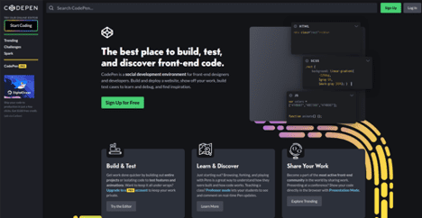
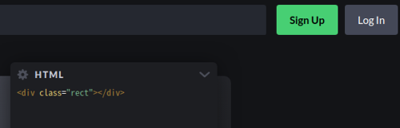
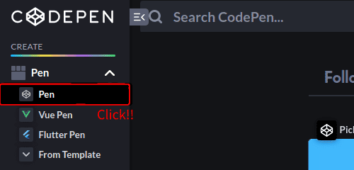

## 独学でプログラミングを勉強する方法。HTML編。(第三回)

<p class="mt-8 mb-8">
実際に手を動かして勉強しよう！
</p>

<div class="mt-8 mb-8">
<nav class='blog-nav'> 
  <div class='inner'>
    <p>目次</p>
    <ol class="top-ol">
      <li class="top-li">Codepenのアカウント作成</li>
      <li class="top-li">HTMLでHello World</li>
      <li class="top-li">HTMLとは</li>
      <li class="top-li">ちょっとした文章を書いてみよう</li>
      <li class="top-li">ドットインストール</li>
      <li class="top-li">Github</li>
    </ol>
  </div>
</nav>
</div>

<p class="mb-16">
プログラミングを学習する方法を紹介していきたいと思います。<br/>
<a src="https://www.yas-ito.com/blog/learning-programming-language-2/">前回</a>では、調べ方を紹介しました。
今回は実践編です。まずは<strong>習うより慣れろ</strong>です。
</p>

## 自己紹介

<p class="mt-8 mb-16">
現役プログラマー。この道 15 年ですが、まだまだ現役を続けたいと思っています。
バックエンドを担当していますが、たまにフロントを少しだけお手伝いします。
</p>

## Codepenのアカウント作成

<p class="mt-8 mb-8">
Codepenは無料でHTML/CSS/Javascript編集、実行できるWebサイトです。
</p>



<p class="mt-8 mb-8">
初心者の方が最初につまづくものとして、環境のセットアップがあります。しかし、Codepanを使えば煩わしいセットアップはありません。
とりあえずプログラミングを体感するのが目的な場合はCodepenが最適だと思います。
</p>
<p class="mt-8 mb-8">
注意点として、Codepenで<strong>一生懸命コードを書いてもそのままWebサイトができるわけでありません</strong>。
Webサイトを立ち上げる場合はプログラミング以外に色々とやらなけれいけません。Codepenでは、あくまでプログラミングを体感する、コードの動作を確かめたい場合に利用して下さい。
</p>
<p class="mb-16">
<a src="https://codepen.io/">Codepenの公式サイトはこちらから</a>
</p>
<p class="mb-8">
画面右上にあるSign Upからアカウントを作成して下さい。
</p>




## HTMLでHello World

<p class="mt-8 mb-8">
まずはログインしてから画面左のメニューのPenをクリックして下さい。
</p>



<p class="mt-8 mb-8">
すると以下の画面が表示されます。
</p>


<p class="mt-8 mb-8">
画面左のHTMLに以下のように入力して下さい。
</p>


<p class="mt-8 mb-8">
下の画面にHello Worldと表示されたと思います。
</p>

## HTMLとは

<p class="mt-8 mb-8">
HTMLとはHyperText Markup Languageの意味です。厳密にいうとHTMLはプログラミング言語ではありません。
</p>
<p class="mb-16">
HTMLとはコンピュータが理解できるように、文章にタグをつけて意味をもたせる、というものです。
これだけだと意味が分からないと思います。
</p>
<p class="mb-16">
コンピュータは人間と違って、人間の言葉が理解できません。
そこで、どの文章がタイトルで、どの文章がリストで、などを記述してあげる必要があります。そして、コンピュータはそのタグを元に表示を変えたりします。ちなみに、SEOにとっても重要になってきますが、それは別の記事で紹介します。
</p>
<p class="mb-8">
例えば先程の例では以下のように入力しました。
</p>

```html:title=index.html
<h1>Hello World</h1>
```

<p class="mt-8 mb-8">
さて、h1というのは見出しです。h1〜h6まであります。1が一番大きく、6が一番小さい見出しです。
新聞だと一面にデカデカと記載される見出しが、htmlで言うところのh1です。
</p>
<p class="mb-8">
タグはたくさん種類があります。例えば、
</p>

<div class="mt-8 mb-8">

- p
- ul, li
- br
- strong

</div>
<p class="mb-8">
などです。他にも大変多くのタグが存在しますが、一度に全部覚える必要はありません。<strong>一つずつ覚えていきましょう</strong>。
</p>

## ちょっとした文章を書いてみよう

<p class="mt-8 mb-8">
では、以下の文章を先程のCodepenの画面に打ち込んで見て下さい。
</p>

```html:title=index.html
<h1>Hello World</h1>
<p>今日は若干冷えますね。</p>
<p>ええ、すっかり冬になりました。<br/>明日は雪のようです。</p>
<p>明日これを仕入れたいのですが。<strong>在庫はありますか？</strong></p>
<ul>
  <li>醤油</li>
  <li>みりん</li>
</ul>
<p>ええ、ありますとも。</p>
```

<table border="1">
    <tr>
        <th>タグ</th>
        <th>説明</th>
    </tr>
    <tr>
        <td>p</td>
        <td>パラグラフを意味します。つまり段落です。意味のある塊を表現したい場合に使います。</td>
    </tr>
    <tr>
        <td>br</td>
        <td>改行を意味します。pタグの中で意図的に改行する時はbrタグを使用します。</td>
    </tr>
    <tr>
        <td>strong</td>
        <td>強調したい文字がある時に使用します。</td>
    </tr>
    <tr>
        <td>ul/li</td>
        <td>リストを表現したい時に使用します。</td>
    </tr>
    
</table>

<p class="mt-8 mb-8">
このように、コンピュータに分かるように、文章に意味を持たせることができます。
近年は、SEO対策でこれらのタグを使い分ける、という意味の方が大きいかもしれません。
</p>
<p class="mb-16">
というのも、単純に見た目だけをきれいにするのであれば、CSSを利用することで可能だからです。
CSSについては次回紹介します。
</p>


