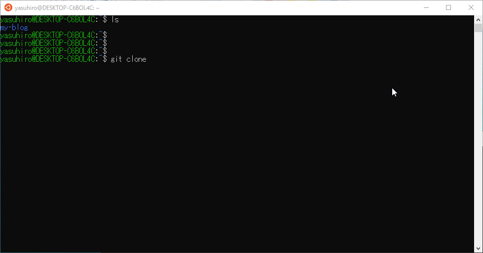

## 【初心者向け】プログラミングに向いてるパソコンについて教えます

プログラミングを始めたいけど、どんなパソコンがよいか分かりません。教えて下さい！

<nav class='blog-nav'> 
  

    
目次

    <ol class="top-ol">
      <li class="top-li"><a href="#laptop">パソコンの選び方を知る</a></li>
      <li class="top-li"><a href="#os">OSの選び方</a>
        <ol>
          <li><a href="#windows">Windows</a></li>
          <li><a href="#osx">OS X</a></li>
          <li><a href="#compare">比較</a></li>
          <li><a href="#select">どちらを選ぶべきか</a></li>
        </ol>
      </li>
      <li class="top-li"><a href="#hardware">ハードウェア</a>
        <ol>
          <li><a href="#cpu">CPU</a></li>
          <li><a href="#ram">メモリ</a></li>
          <li><a href="#ssd">SSD/HDD</a></li>
        </ol>
      </li>
      <li class="top-li"><a href="#laptop-list">実際にパソコンを見てみよう</a>
        <ol>
          <li><a href="#windows-pc">Windows Pro搭載 TOSHIBA Dynabook B65/ER</a></li>
          <li><a href="#mac-pc">Apple Macbook Air</a></li>
        </ol>
      </li>
    </ol>
  

</nav>

## 自己紹介

プログラミング歴15年の現役プログラマー。現在は都内のIT企業でソフトウェアの開発を行っております。

<h2 id="laptop">パソコンの選び方を知る</h2>

結論を先に言ってしまうと、例外はありますが<strong>古すぎないパソコンであればなんでもよいです</strong>。ただし、パソコンごとに苦労するポイントが違うので、それを理解した上で選定すべきです。例外については後で紹介していますので、最後までご覧ください。

なぜ、パソコンはなんでもよい、と断言したかというと、ほとんどのパソコンでプログラミングすることができるからです。別に高いパソコンだからプログラミングができるわけではありません。

例えば、私もつい最近、秋葉原で中古パソコンを3,3000円で買いました。たぶん、5年くらい前に販売されたものだと思いますが、今のところプログラミングできています。

プログラミング用に高いパソコンを勧めているサイトを見かけたことがあるかもしれません。もちろん高いパソコンの方がプログラミングをしている時のストレスは少ないと思います。しかし、初心者のうちからそんな高価なパソコンは必要ありません。

まずは、最低限のポイントを理解した上で、今持っているパソコンでプログラミングを始めるか、もしくは新規に購入するか、レンタルするのか判断しましょう。

<h2 id="os">OSの選び方</h2>

OSとは、オペレーティングシステム(Operating System)の頭文字をとったものです。有名なOSとして、WindowsやOS X(Apple社のMacに搭載)というものがあります。一度は聞いたことがある方も多いと思います。さて、OSとはなんぞや、という説明はここではしません。ただし、プログラミングをする環境を構築する上で、どのOSを選択するかを決めることは大変重要である、ということは覚えてください。

なぜならば、<strong>OSが違うと使えるソフトウェアも違う</strong>からです。つまり、WindowsとMacでのプログラミングの環境構築方法が違うということです。

プログラミングをしていると、ターミナルというソフトウェアを使用して環境構築することがしばしばあります。

WindowsではコマンドプロンプトやPower Shell、Macではzshというターミナルがデフォルトで入っています。それぞれ使い方が結構違います。プログラマーは、ある程度その使い方を覚えなければいけません。別種類のターミナルを使う場合は新たに使い方を覚えないといけない、という問題があります。正直、<strong>結構面倒くさい</strong>です。

仮想環境というものを導入することで、WindowsやMacでも同じターミナルを使う方法はあります。筆者は仮想環境を使ってWindows上でLinuxという別のOSを動かしています。他にも方法はいくつかあります。しかし、初心者の方にはどれもハードルが少し高いのでお勧めしません。

慣れてきたら両方使ってみる、というのもありです。筆者はどちらでもいけます。ただし、最初はどちらにするか選びましょう。

<h3 id="windows">Windows</h3>

Windowsは、アメリカのマイクロソフト社が開発、販売しているOSであり、パソコン市場のトップシェアを誇るOSです。

<strong>長所</strong>

<ul class='cp_list'>
  <li>Windows搭載機は安いものから高いものまであり、価格帯が幅広い</li>
  <li>種類が豊富なので、自分が欲しいスペックのものを見つけやすい</li>
  <li>マイクロソフト製品向けのソフトウェアを開発するならWindowsが最適</li>
  <li>ちょっとした設定などインターネットにたくさん情報がある</li>
  <li>WordやPower Pointなど、プログラミング以外の仕事で使いやすい</li>
  <li>会社員といえばWindows</li>
</ul>

<strong>短所</strong>

<ul class='cp_list'>
  <li>Linux系のツール使うとき、いろいろセットアップが面倒くさい</li>
</ul>

開発にLinuxというOSを使っている会社もたくさんあります。なぜLinuxを使うかというと、<strong>無料だから</strong>です。会社では稟議通さないとモノを購入できません。しかし、Linuxは無料なので、いちいち稟議あげなくてよい、という利点があります。

実際に私の会社でも数多くのLinux搭載機が稼働しています。

Windowsだけじゃダメなのか、と疑問に思う方もいらっしゃると思います。もちろんXboxやWindows上で動くソフトウェアを作ることを考えているのであれば、Windowsだけでも問題ありません。しかし、もし皆さんがWeb開発、とくに<strong>バックエンドの開発</strong>に携わりたいと考えているのであれば、いずれLinuxを触る日が来るかもしれません。

将来的にWeb開発をがっつりやりたい、と考えているの出れば、Linuxのセットアップがめんどうくさいかも、という認識を持ちましょう。最初はあまり関係ないので、気にする必要はありません。

補足ですが、WindowsにはHomeとProとありますが、<strong>可能であるならProの方を入手しましょう</strong>。

<h3 id="osx">OS X</h3>

OS Xは、アメリカのApple社が開発しているOSでありMacに搭載されています。Web系の開発者やデザイナーに人気のパソコンです。

<strong>長所</strong>

<ul class="cp_list">
  <li>カフェや空港でMacbook開いている人はオシャレ(偏見)</li>
  <li>Unix系のコマンドが最初から使える</li>
  <li>Apple製品向けのソフトウェアを開発するなら必須</li>
  <li>操作性が素晴らしい</li>
  <li>その気になればWindowsも動かすことができる</li>
</ul>
  

<strong>短所</strong>

<ul class="cp_list">
  <li>プログラミング以外の目的で使おうとした場合、稀に問題が起こる</li>
  <li>Windowsに慣れすぎている人には最初操作を覚えるのが辛い</li>
  <li>ノートパソコンに低価格帯のものがない</li>
</ul>
  

Macの魅力は、Unix系のツールがデフォルトで使えるという点です。UnixというのはLinuxの祖先であり、操作もLinuxと非常に似ています。つまり、Macの使い方を知っていれば、Linuxの操作もそれほど違和感なく使えるはずです。余計なセットアップなくUnixが使える、というのは初心者の方にとってありがたいことだと思います。

ただし、世の中のWebサービスのほとんどはWindowsを想定して作られているため、稀にMacだと上手く動かない場合もあります。しかし、Mac機にWindowsをインストールすることができるため、Windowsが必要ならインストールすればよいです。

<h3 id="compare">比較</h3>

下記の表は筆者の独断と偏見に基づくものです。

| 比較項目 | Windows | OS X(Macbook) |
| ---- | ---- | ---- |
|Web開発| 悪くない | よい |
|Windowsアプリ開発| 非常によい | やめとけ |
|iPhone/Macアプリ開発| やめとけ | 非常によい |
|Androidアプリ開発| 悪くない | 悪くない |
|組み込み開発| よい | ものによる |
|サラリーマン業務| よい | 会社によっては使えない |
|柔軟性| 中 | 高 |
|価格| 低～高 | 高 |
|オシャレ度| 低 | 高 |

<h3 id="select">どちらを選ぶべきか</h3>

どちらも長所があるので、どちらがよいか断言はできません。あくまで目安としてお使いください。 
さて、記事の最初の方で「例外」について触れました。その例外とはiPhoneアプリを作りたい、という場合です。Windowsでも無理をすれば多少できるかもしれませんが、あきらかにMacを使った方がよいです。iPhoneアプリを開発したいのであれば素直にMacを買いましょう。

<strong>以下の傾向がある人はWindows 10</strong>

<ul class="cp_list">
  <li>iPhoneアプリに興味がない</li>
  <li>プログラミングやめた後も仕事や就活でパソコン使いたい</li>
  <li>時間よりもお金を節約したい</li>
</ul>

<strong>以下の傾向がある人はMac</strong>

<ul class="cp_list">
  <li>オシャレなものが好き</li>
  <li>スマホアプリに興味あり</li>
  <li>金銭的余裕がある</li>
  <li>Web開発に興味あり</li>
</ul>

<h2 id="hardware">ハードウェア</h2>

ハードウェアとは、皆さんがイメージするパソコン本体のことです。パソコンのスペック表に何やら書いてありますので、それらを説明していきたいと思います。

<h3 id="cpu">CPU</h3>

Intel社のCPUが一般的に最も普及しており、iから始まる名前でシリーズ化されております。現在はCorei9まで発売されており、2021年の10月にはCorei10が発売されるようです。たいていのパソコンはIntel社のものが搭載されています。普通にプログラミングやる程度あれば、<strong>Corei5シリーズ以上のものであれば問題ありません</strong>。

CPUはパソコンの頭脳です。Hzとコアの数で性能を表現します。Hzはヘルツと呼びます。 
数値が高ければよいですが、最近のCPUだと単純にHzだけで性能は測れなくなっています。Hzと同じくくらい大切なのが、コアの数。コア数2であれば、並行して二つの演算が同時にできることを意味します。 
単純に言えば、10個の計算をするのに二人ずつ手分けして計算すれば速度は倍になりますよね。CPUも同様にコア数が多いほど、単位時間当たりの処理数が多いことになります。Corei5シリーズはコストも安く、性能も悪くないです。

ちなみに私のパソコンはCorei5 2コアです。使っていると、ちょっと遅いかな、と感じる程度です。

Celeronと呼ばれるシリーズの安いCPUを見かけるかもしれませんが、プログラミング用途でパソコンを使うのであれば、避けたほうがよいです。普通にパソコンを使う分には問題ないですが、プログラミングだと結構きついと思います。

Corei5～Corei9 CPU搭載のパソコンを選びましょう。

<h3 id="cpu">メモリ</h3>

B(バイト)で容量の大きさを表現します。<strong>4GB(ギガバイト)もあれば十分ですが、できれば8GBくらい欲しい</strong>ところです。

データの一時置き場です。テーブルのようなものだと考えてください。テーブルが小さいと、何か新しい作業するときに毎回テーブルをきれいにする必要があります。テーブルが大きいと出しっぱなしにしても作業が継続できるでしょう。

いや、毎回きれいにしろよ、という声も聞こえてきそうですが、コンピュータの世界はナノとかマイクロ秒を競う世界です。もし、毎回テーブルをきれいにしていたら、動作がもっさりすることでしょう。

頻繁にコンピュータがテーブルをきれいにしなくてもよいように、4GB以上のメモリを搭載しているマシンを選びましょう。

<h3 id="cpu">SSD/HDD</h3>

メモリと同様にB(バイト)で容量の大きさを表現します。<strong>128GB(ギガバイト)のSSDであれば十分ですが、できれば256GBかそれ以上欲しい</strong>ところです。

データを保存する装置です。こちらは一時置き場ではなく、本棚のようなものです。パソコンはデータをSSDもしくはHDDから引っ張りだし、そのデータをメモリの上において作業します。

一般的にHDDの方が価格が安くて速度が遅く、SSDの価格が高くて速度が速いです。

正直、パソコンを起動した時以外だとそれほど違いが分かりにくいです。しかも、起動するためのデータは小さいSSDにいれて、それ以外のデータはHDDにいれることで、低価格を維持しつつ起動時間を短縮しているパソコンもあります。

個人的にSSD開発をしている企業で働いていたこともあるので、SSD搭載機を推薦します。

SSDの128GB以上のものを選びましょう。

<h2 id="laptop-list">実際にパソコンを見てみよう</h2>

ここからは実際にパソコンのスペックを見てみましょう。

<h3 id="windows-pc">Windows Pro搭載 TOSHIBA Dynabook B65/ER</h3>

こちらは東芝のDynabookというノートパソコンです。豆知識ですが東芝は老舗のノートパソコンメーカーです。スペックは以下。

| 項目 | スペック |
| ---- | ---- |
| OS | Windows Pro 64bit |
| CPUタイプ | Corei5 |
| CPU速度 | 1.6 GHz |
| プロセッサ数 | 4 |
| RAM容量 | 8GB |
| SSD | 256GB |
| 価格 | 8～9万円 |

プロセッサ数とありますが、これはコアの数のことです。RAM容量とはメモリのことです。コア数が4でSSD搭載。OSもWindows Proです。8万円くらいでこのスペックはかなり優秀ですね。 

最近はこんなに安くこのスペックのパソコンが入手できることに驚いています。十分プログラミングに使えるマシンといえます。筆者も欲しいです。

<a target="_blank" href="https://www.amazon.co.jp/gp/product/B08QVFDWCM/ref=as_li_tl?ie=UTF8&camp=247&creative=1211&creativeASIN=B08QVFDWCM&linkCode=as2&tag=boccochan-22&linkId=e5b63bfbd62a9299313185ba4c16e0e7">
>> Dynabook B65/ERの詳細をAmazonで見る
</a>

<h3 id="mac-pc">Apple Macbook Air</h3>

こちらはApple Macbook Airというパソコンです。美しいパソコンです。筆者も昔、初めて買ったMacがMacbook Airでした。スペックは以下。

| 項目 | スペック |
| ---- | ---- |
| OS | OS X |
| CPUタイプ | M1  |
| CPU速度 | 不明 |
| プロセッサ数 | 8 |
| RAM容量 | 8GB |
| SSD | 256GBもしくは512GB |
| 価格 | 10万円～ |

値段は少し高いですが、結構ハイスペックです。CPU速度の情報は見つからなかったのですが、コア数がなんと8もあります。こちらもプログラミングにも十分使えるパソコンですね。

<a target="_blank" href="https://www.amazon.co.jp/gp/product/B08N6MSX26/ref=as_li_tl?ie=UTF8&camp=247&creative=1211&creativeASIN=B08N6MSX26&linkCode=as2&tag=boccochan-22&linkId=cd7bd1ad6bca5e747ed0488ff61c9530">
>> Apple Macbook Airの詳細をAmazonで見る
</a>