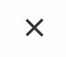

You can create a burger by css.


## html and css

```html:title=index.html
<body>
  <div class="burger">
    <div class="line1"></div>
    <div class="line2"></div>
    <div class="line3"></div>
  </div>
</body>
```

```css:title=style.css
.burger div {
  width: 25px;
  height: 3px;
  background-color: black;
  margin: 5px;
}
```

## Close button

You can make it to close button



```css:title=style.css
.line1 {
  transform: rotate(-45deg) translate(-5px, 6px);
}

.line2 {
  opacity: 0;
}

.line3 {
  transform: rotate(45deg) translate(-5px, -6px);
}
```

## Transition a buger to close button

We need to write a bit of javascript for it.

```js:title=app.js
const burgerEvent = () => {
  const burger = document.querySelector(".burger");

  burger.addEventListener("click", () => {
    burger.classList.toggle("toggle");
  });
};

burgerEvent();
```

```html:title=index.html
<html>
  <head>
    <meta charset="UTF-8" />
    <meta name="viewport" content="width=device-width, initial-scale=1.0" />
    <meta http-equiv="X-UA-Compatible" content="ie=edge" />
    <link
      href="https://fonts.googleapis.com/css?family=Poppins"
      rel="stylesheet"
    />
    <link rel="stylesheet" href="style.css" />
    <title>burger</title>
  </head>
  <body>
    <div class="burger">
      <div class="line1"></div>
      <div class="line2"></div>
      <div class="line3"></div>
    </div>
    <script src="app.js"></script>
  </body>
</html>
```

```css:title=style.css
.burger div {
  width: 25px;
  height: 3px;
  background-color: black;
  margin: 5px;
}

.toggle .line1 {
  transform: rotate(-45deg) translate(-5px, 6px);
}

.toggle .line2 {
  opacity: 0;
}

.toggle .line3 {
  transform: rotate(45deg) translate(-5px, -6px);
}
```
