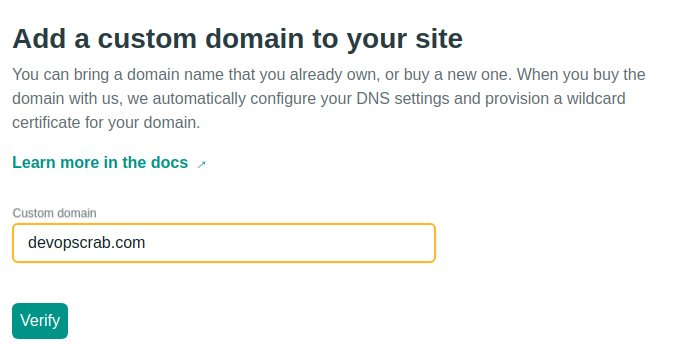
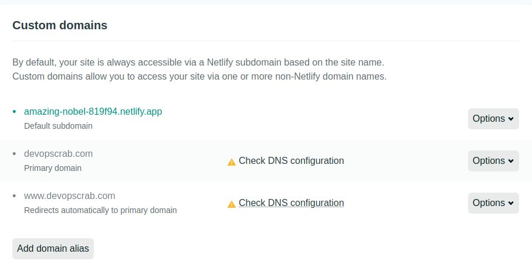
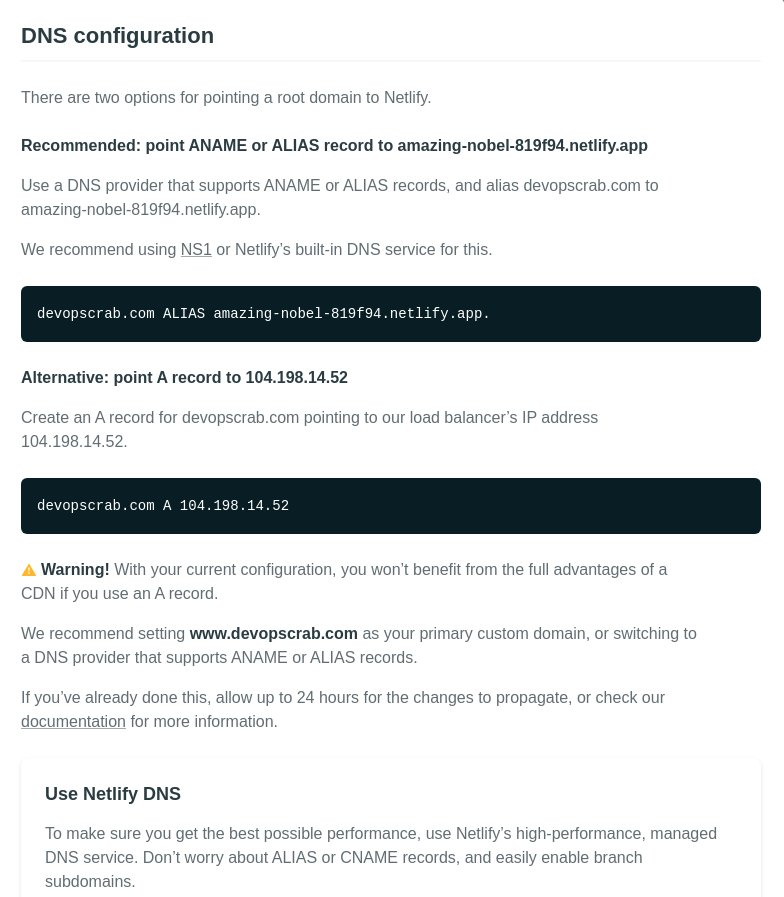

If you don't set custom domain, the URL will be something like https://amazing-nobel-819f94.netlify.app. You can use original domain name. I am going to tell you how to do it.

First of all, you need to buy a domain name. I found a clouple of sites for buying domain.

- [GoDaddy](https://sg.godaddy.com/offers/domains/godaddy-domains?isc=gofkgjp01&countryview=1&currencyType=jpy&gclid=Cj0KCQjw6ar4BRDnARIsAITGzlAKaaPMdXp48GZKQZtvfRbYBqlWYtljjLA4rz-cAbGd6liCPdPRhlcaAtLAEALw_wcB&gclsrc=aw.ds)
- [namecheap.com](https://www.namecheap.com/)

Of course, you can buy a domain in the other web site.

## Adding custom domain to Netlify


Click Add custom domain.



Click verify. If you can use the domain, it will be passed.



If you click Check DNS configuration, you can see the below dialog.



You need to set Primary domain and Redirects automatically to primary domain both.

## How to set DNS record?

You should check a website where you bought your domain. You should be able to register A/CNAME records there. If you are not sure, you should ask to the company.

### Let's check dig command

After registering A/CNAME records, you can check if the registeration is done by dig command.

```bash
dig please-enter-your-domain-name
```

Since DNS takes a time to spread records to all around the world, it might take a time.

Also, you can check by [DNS Propagation Check](https://dnspropagation.net/). Please wait for a while. It might take a day or more. After that, you should be able to see your website by your original URL.
