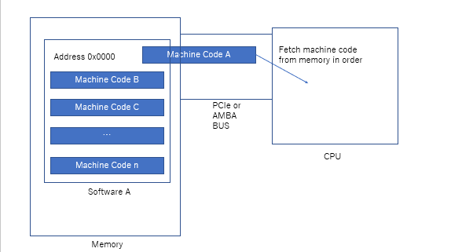

If you just started to learn programming, you might wonder how comptures execute your program. Your question is pretty fare, it seems magic or something. But, you need to understand basic concept if you want to be software engineer. It does not matter what kind of software engineer is. I am going to explain how it works simply. I assume that readers are learning high-level programming language, so I am not telling very details around CPU.

<nav class="blog-nav">

Index

<ol class='top-ol-1'>
<li class='top-li-1'>
<a href='#h-0'>Software is a chunk of tiny codes</a>
</li>
<li class='top-li-1'>
<a href='#h-1'>Fetching a machine code</a>
</li>
<li class='top-li-1'>
<a href='#h-2'>How to execute a code</a>
</li>

</ol>

</nav>

<h2>About author</h2>

Having 15 years professional experience and still working as a software engineer.

<h2 id="h-0">Software is a chunk of tiny codes</h2>

Software consists of a chunk of tiny machine codes. Each code is very simple, but it is difficult to read for human. Fortunately, we do not need to learn those primitive codes. Compilers or interpreters handle them. You might have heard assembler language. Assembler language is almost equal to machine language, but it is readable for us.

Here is sample of those assembler code. 

| code | parameters |explain |
| ---- | ---- | ---- |
| MOV | address | Move data |
| ADD | number, address | Add number |

CPU has their own dialect of assembler language. Compilers or interpreters absorbs those dialects. So, you will never see those language as long as you write iphone or web application.

Do you need to know assembler languages? No, you do not. But you must understand how CPU handles a program even if you are learning web programming. And you need to know about assembler language a little bit for understanding around CPU.

A program is a chunk of machine code. That is really important concept. Please do not forget if you are programmer.

<h2 id="h-1">Fetching a machine code</h2>

CPU fetches a machine code from DRAM memory. I do not explanation about cache here for making things simple.

The most important thing is that CPU can fetch one machine code at the same time. In addition, CPU can fetch a machine code in order, such as address 0x0000, 0x0002,  0x0004 and so on. This explanation is not accurate since 'if' statement or calling function can change the next address which should be fetched. But I want to skip the explation about program counter for making things simple. 

You might think about multi-core CPU like Core i series. Those CPU can handle multiple code at the same time, but still each core executes one machine code at the same time.

CPU read a machine code in order from DRAM. This is also very important to understand synchronous, asynchronous, thread and process. Please keep it mind.

<h2 id="h-2">How to execute a code</h2>

CPU executes a code and put a result on a memory. If you are learning high-level programming language, it is not very import to understand how CPU execute them.

That's because you CAN NOT control them anyway. 

You need to remember that fetching a code in order from a memory. 

