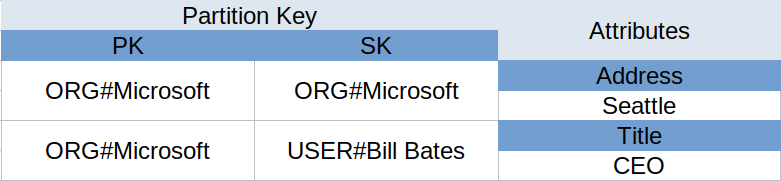

You might just started to think about DynamoDB. But wait, you need to read this article first.
I assume that it is a bit difficult to understand the concept of DynamoDB especially if you are used to RDMS.
So, I am going to tell you some tips.

## One table in DynamoDB

DynamoDB can have different type of data in a table and each items (rows) can have different data pattern. So, you need just ONE table in dynamoDB. 
Probably, you really want to create a lot of tables in a database if you are used to RDMS. However, normalize does not fit to DynamoDB.

DynamoDB provides simple functions to access. They does not have complex queries like RDMS. In return, DynamoDB provides stable performance and scalability.

But you might not be able to imagine how design the data model. Okay, let me explain that.

## Think access pattern

You must think the access pattern in the beginning anyway. If not, you can not design a table very well. 
Of course, you can think tables like RDMS first to know what kind of data you need. But still you need to know access pattern.

Why? Again, there is not write complex queries in DynamoDB.

But, don't worry. Even if you are used to DynamoDB, you will need to redesign multiple times.

## Column name can be general terms

I reccomend you the name of primay key or global secondary index should be general.

For example, I would name 'pk' and 'sk' to partition and sort key. But how can we query them?

You can put identifier or metadata with data. Look at the below table



You can see ORG in front of Microsoft. If you want to get the data by python, it would be

```python
table.get_item(Key={'pk': 'ORG#Microsoft', 'sk': 'ORG#Microsoft'})
```

If you want to get users of Microsoft, I would put the global secondary index to sk and pk. Let's say the key name 'sk-pk'.

```python
table.query(
        IndexName='sk-pk'
        KeyConditionExpression=Key('sk').eq('ORG#Microsoft') & Key('pk').begin_with('USER')
    )
```

You can only use begin_with to query sort keys (sk, GSI1SK or GSI2SK). 

I prefere to use pk, sk, GSI1PK, GSI1SK, GSI2PK, GSI2SK and so on for indexs. 


## Duplicate data is not bad

Since the cost per bit was expensive, RDMS need to keep data small as much as possible. But it is not anymore. 
So, you can put the same data in different columns in DynamoDB.

Look the below table.


If you love RDMS, you really want to normalize ORG#Microsoft. But don't do that. 

## Good articles 

You should read some articles if possible. 

- [AWS DynamoDB core concepts](https://docs.aws.amazon.com/amazondynamodb/latest/developerguide/HowItWorks.CoreComponents.html)
- [AWS DynamoDB best practices](https://docs.aws.amazon.com/amazondynamodb/latest/developerguide/best-practices.html)

This book is a bit expensive, but it was really practical.

- [The DynamoDB book](https://www.dynamodbbook.com/#buy)