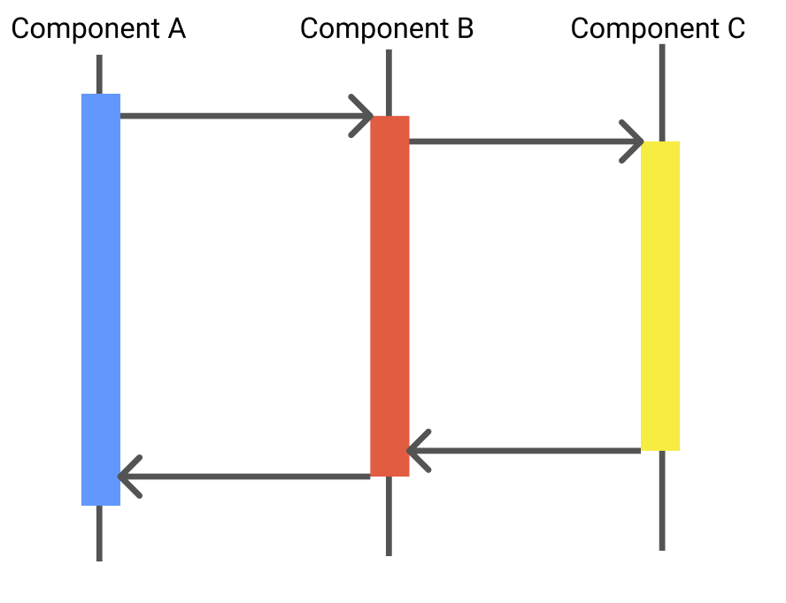
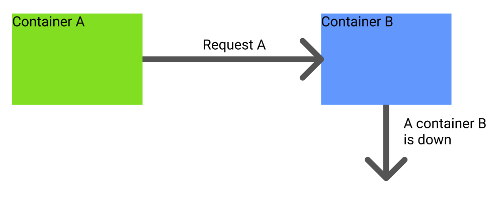
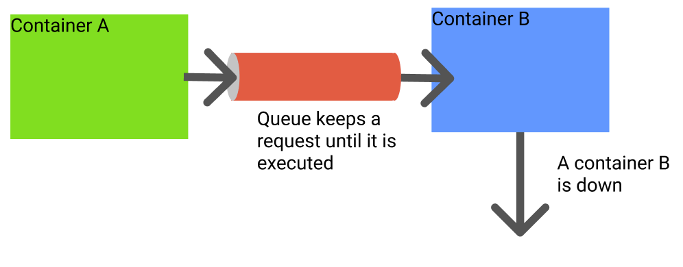

When I started to learn a micro service architecture, I did not understand how to implement it at all.
But I have been studying the micro service architecture on AWS over three years, I just started to know how to implement it. It is not perfect yet, but I would like to share my knowledge with you!

## Asyncronous execution 

Each component such as containers or AWS Lambda should work asynchronously as much as possible. If each component or parts of your system execute requests synchronously, the system does not work well. 

Component A waits the processing of Components B and C. In that case, Component A can not do anything during waiting a response from Component B. You can imagin what will happen if all components wait responses from other components. So, Component A should not wait the response from Component B. 

Of course, asynchronous execution might not fit for your system if the ordering of requests is important. If so, you might need to think other architecture.

If the ordering is not important for your system, you should think asynchronous execution. 

### Idempotency is important for asynchronous execution

If a software executes a request asynchronously, the result should be the same as the first time when it is retried. Since asynchronous execution might fail for some reasons, the software needs to retry the request. If the result is changed, probably, your system will go wrong.

If a Web API adds an ordered book for each time when it is retried, the customer will recieve a couple of books. I am pretty sure that your customer will get angry. We MUST avoid it.

As long as I designed software, it is possible to be idempotence the most of time.

Idempotency is required to run your system correctly.

### High scalable and robust queue 

Queue helps to make your system asynchronous. Fortunately, AWS provides a high scalable and robus queue to us which is [Simple Queue Service](https://aws.amazon.com/sqs/?nc1=h_ls).

> Amazon Simple Queue Service (SQS) is a fully managed message queuing service that enables you to decouple and scale microservices, distributed systems, and serverless applications. 

A company which I worked before did not use this kind of services even though they tried to build a software as a micro service. It is almost impossible. Let me explain it.

Container A sends Request A without queue. Then, if Container B is down. What will happend? If Container A does not wait the response from Container B, the request will be lost forever. Of course, if Container A executes the request synchronously, Container A can know if the request is failed or not. But, again, if all containers run synchronously, your system would not run correctly. We need to execute requests asynchronously.

If Queue keeps requests, Container A might not need to know the result. Even if Container B is down, Queue keeps all outstanding requests. So, Container A can execute requests asynchronously. AWS SQS provides this kind of service for you!

Using a high and robus queue like SQS is the key factor for a micro service architecture.

## Monitoring system must be implenented

We need to monitor our system anyway. It does not matter if the system is micro service or not. Some venders provides excellent monitoring systems such as Datadog. But it might quit expensive for you.

[Sentry](https://sentry.io/welcome/?utm_source=google&utm_medium=cpc&utm_campaign=9575834316&content=463631231007&utm_term=sentry%20application%20monitoring&gclid=Cj0KCQjwl9GCBhDvARIsAFunhsl2Bay-suTrebmudVR2pWyNVXQL3y1RFf8P79Rcb3ymmYXEhMeEoLwaAqHQEALw_wcB) might be a good monitoring service for you. There is an [onpremise](https://github.com/getsentry/onpremise) version which is free. 

If a component throws an exception, the component should send a message to tell who and why throws an exception. If not, you can not debug or trace problems.

## Serverless is preferred

Serverless is not mandatory for a micro service architecture, but serverless architecture fits really well with a micro service. The one of the strengths of a micro service architecture is scalability. 

You can up and down containers on demand. Also, you can develop and update some components independently. However, if you run your software on a single server, you alway need to care the capability of servers. 

So, I recommend you to use serverless service such as [AWS Lambda](https://aws.amazon.com/lambda/?nc1=h_ls) or [AWS Fargate](https://aws.amazon.com/fargate/?nc1=h_ls&whats-new-cards.sort-by=item.additionalFields.postDateTime&whats-new-cards.sort-order=desc&fargate-blogs.sort-by=item.additionalFields.createdDate&fargate-blogs.sort-order=desc).

Is it expensive? No, if you just started your project. It will be much cheaper than servers. When your project and buisiness expands enough, it is time to think move your system on servers.

You do not need to pay money for servers which does not make money at all. Serverless services will help your project very well.

## NoSQL 

NoSQL fits a micro service well. NoSQL database can scale easily and provide stable performance because of their architecture. [AWS DynamoDB](https://aws.amazon.com/dynamodb/?nc1=h_ls), for example, does not have the connection limit like RDMS and you do not need to prepare servers.

AWS announced a new database architecture years ago. They realized that they do not need some characteristics of RDMS all the time and those characteristics sacrifice scalability and performance stability. 

If your system does not need very complex query or complex data relations, NoSQL is a great option for you. Of course, you can combine them in your system.
