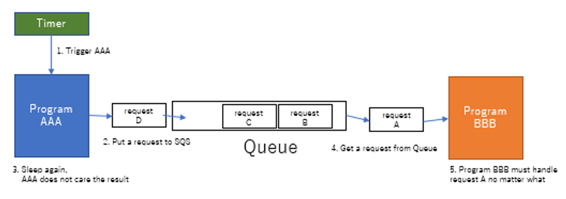

Synchronous and asynchronous confuse begineers or even intermediate level of programmers. I am going to explain how different they are as simple as possible, also how you can create asynchronous system.

## Synchronous execution is simple

Synchronous execution is just executing a machine code in order. It is the same as how CPU runs a program. If you do not know how CPU works, please check [this article](/en/blogs/how-cpu-execute-program). The article is pretty short and easy to understand. No worries.

CPU can run a code step by step. The problem of synchronous is if some code can not go to next for some reason, the program will be freazed. 

For example, a web site is trying to get an image from their server, but the server does not send anything, the web site might freaze if the web site waits the response from the server.

That is why we need asynchronous execution. Asynchronous does not wait the response. 


## Asynchronous execution is like Amazon


Imagin, you ordered a book at Amazon. Do you need to wait until the book arrives? If you can not do anything except waiting a book, you might die because you can not eat food or sleep. As long as I know, people go out or do some different tasks after ordered a book, right? That is asynchronous execution.

As I explained, CPU can run a code in order. So, if CPU does not need to wait the result of the executed code, CPU can do some different tasks during waiting.

But, wait. How or when does software know the result? 

It depends on a system or programming language. I mean that asynchronous is just idea or concept, so each system or programming language implements their own way.

That is why asynchoronous execution confuses begineers I think. 

Anyway, do not think too much yet. Asynchronous is just like Amazon or other EC site. CPU does not need to wait when a code is executed asynchronously.

### When does software get a result?

When a processing is finished, it is ready to go. But a software does not know when it will finish. So, Javascript, for example, provides promise or callback function.

For example, if a software want to fetch data from a server, you might write like belowing.

```javascript
axios.get('https://api.something.com')
  .then((response) => {
    console.log('Successed!!', response)
  })
  .catch((err) => {
    console.log('Failed!!', err)
  })
```

'then' block will be executed when all processing of a backend server is finished without error. 'then' block will be fired in the future, but the 'axios.get' does not block anything. So, the software can run progress bar or spinner during waiting. 'catch' block will be fired when API returns error.

This is asynchronous execution in Javascript.

Why do we need this kind of technique? Again, CPU can execute codes in order. If some codes block and CPU can not execute the next code, the software will freaze. Software need to release CPU.

So, Javascript provides the way of releasing CPU. That is called asynchronous. A program can get result by 'then' or 'catch' block.

### No need results all the time

Software does not need results in some cases. If a system has to complete a request no matter what, the system does not need to return error to client.

See the belowing





Program AAA believes that requests in a queue will be executed and succeeded. So, Program AAA does not care the result. In this case, Program AAA sends requests asynchronously. But Program AAA does not check the result.

The queue can not lose a request for sure. Program BBB must execute and complete the request no matter what. 

Is it possible to implement that kind of system? No, it is not. But we can build similar systems. For example, AWS, Azure and GCP provides high robust and reliable queue systems. A robust and reliable queue is the one of the key components for micro service architecture.

In some cases, programs does not need to wait the result of a processing. But, it is also asynchronous execution.


