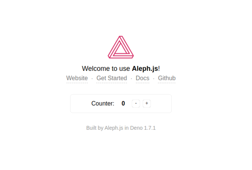

## Aleph.jsとは。Denoで動くReactフレームワークです。

<nav class='blog-nav'> 
  <div class='inner'>
    <p>目次</p>
    <ol class="top-ol">
      <li class="top-li">Aleph.jsはReactのフレームワーク</li>
      <li class="top-li">Denoをインストール</li>
      <li class="top-li">Aleph.jsのセットアップ方法</li>
      <li class="top-li">感想</li>
    </ol>
  </div>
</nav>

<p class="mt-8 mb-8">
本日はDenoで動くReactフレームワークのAleph.jsについて紹介します。
</p>

## Aleph.jsはReactのフレームワーク
<p class="mb-16">
Next.jsからインスパイアされたAleph.jsはDenoで動くReactフレームワークです。しかしながら、Next.jsのようにwebpackやバンドラを必要としません。モジュールに変更があった場合は、変更のモジュールのみコンパイルされメモリ上に展開されるため、<strong>バンドリングが必要ありません</strong>。
</p>

ふむ、素晴らしい。
ということで、早速Aleph.jsを試してみることにしました。


## Denoをインストール

<p class="mt-8 mb-8">
<a src="https://deno.land/">Denoの公式サイト</a>を参考にセットアップしました。<br/>
私はLinux使っておりますので、以下を実行します。Macも同じだそうです。
</p>

```title:bash
curl -fsSL https://deno.land/x/install/install.sh | sh
```

<p class="mt-8">
ちなみに、私の環境ではパスが通ってなかったので、以下を~/.bashrcに書きました。
</p>

```title:bash
export PATH=$PATH:~/.deno/bin
```

<p class="mt-8">
あとは、ターミナルから以下を実行
</p>


```title:bash
source ~/.bashrc
```


### Denoの動作確認

```title:bash
deno run https://deno.land/std/examples/welcome.ts
```

<p class="mt-8 mb-8">
Hello World的なのが表示されます。ファイルをダウンロードしてきているようで若干時間がかかります。
</p>

## Aleph.jsのセットアップ方法

```title:bash
deno install -A -f -n aleph https://deno.land/x/aleph@v0.3.0-alpha.1/cli.ts
aleph init hello
cd hello
aleph dev
```

<p class="mt-8 mb-16">
初回はダウンロードやらコンパイルがあるせいか、結構時間かかります。<br/>
起動が環境すると以下の画面が表示されます。
</p>



## 感想
<p class="mt-8 mb-16">
実際に変更してからリロードまでの時間が<strong>とてつもなく早い</strong>です。
Rollupもかなり早いらしいですが、どちらが早いのでしょうか。
</p>
<p class="mb-16">
Typescript用のコンフィグやらWebpack用のコンフィグやらが全然ありません。<br/>
すごくディレクトリがスッキリして見えます。
</p>

もうちょっと遊んでみようと思います。


