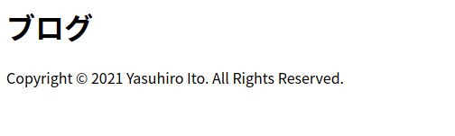

## Gatsby＋Typescriptで多言語対応(i18n)

<div class="mt-8 mb-8">

<nav class='blog-nav'> 
  <div class='inner'>
    <p>目次</p>
    <ol class="top-ol">
      <li class="top-li">必要なパッケージをインストールする</li>
      <li class="top-li">各言語用のファイルを用意</li>
      <li class="top-li">config.tsの作成</li>
      <li class="top-li">HOCの準備</li>
      <li class="top-li">Layoutへの組み込み</li>
      <li class="top-li">gatsby-plugin-layoutを使うと便利</li>
      <li class="top-li">i18nを使って文字を表示してみる</li>
      <li class="top-li">動作確認</li>
    </ol>
  </div>
</nav>

</div>

<p class="mb-8">
Gatsbyでi18n対応する方法を紹介します。<br/>
いろいろ調べたのですが、意外とハマったので参考になれば幸いです。
今回の記事では表示を切り替えるところまでです。URL周りはまた別の記事で紹介します。
</p>

## 必要なパッケージをインストールする

<p class="mt-8 mb-8">
まずは必要なパッケージをインストールします。

</p>

```bash
yarn add i18next i18next-browser-languagedetector i18next-xhr-backend react-i18next
```

<p class="mt-8 mb-8">
i18next-xhr-backendは必要ないかもしれませんが、一応インストールしておきます。
</p>

## 各言語用のファイルを用意

<p class="mt-8 mb-8">
私のディレクトリ構造は以下です。お使いの環境に合わせていただいてかまいせん。
</p>

```
-- src/
  -- components/
    -- layout.tsx
    -- withTrans.ts
  -- i18n/
    -- config.ts
    -- locales/
      -- ja.json
      -- en.json
  -- pages/
    -- index.tsx
-- gatsby-config.js
-- package.json
```


```json:title=ja.json
{
  "blog": "ブログ"
}
```

```json:title=en.json
{
  "blog": "Blog"
}
```

## config.tsの作成

<p class="mt-8 mb-8">
下記はi18nを初期化するコードです。resourcesのところでファイルを指定しています。<br/>
先程作成した言語ファイルのパスを指定して下さい。
</p>

```ts:title=config.ts
import i18next from 'i18next'
import LanguageDetector from 'i18next-browser-languagedetector'

i18next.use(LanguageDetector).init({
  fallbackLng: 'en',
  resources: {
    ja: {
      translations: require('./locales/ja.json'),
    },
    en: {
      translations: require('./locales/en.json'),
    },
  },
  ns: ['translations'],
  defaultNS: 'translations',
  returnObjects: true,
  debug: process.env.NODE_ENV === 'development',
  interpolation: {
    escapeValue: false, // not needed for react!!
  },
  react: {
    wait: true,
  },
})

i18next.languages = ['ja', 'en']

export default i18next

```

## HOCの準備

<p class="mt-8 mb-8">
HOCを準備します。HOCとはなんぞや、というのは知らなくてOKです。なんかWrapper的なの、くらいの認識でかまいません。

</p>


```tsx:title=withTrans.ts
import React, { Component } from 'react'
import i18next from '../i18n/config'
import { I18nextProvider, withTranslation } from 'react-i18next'

export function withTrans(WrappedComponent) {
  WrappedComponent = withTranslation()(WrappedComponent)

  return class extends Component {
    render() {
      return (
        <I18nextProvider i18n={i18next}>
          <WrappedComponent {...this.props} language={i18next.language} />
        </I18nextProvider>
      )
    }
  }
}

```

## Layoutへの組み込み

<p class="mt-8 mb-8">
恐らく、Layoutは宣言していると思いますので、LayoutをwithTransでWrapします。Layout使ってないという方は、適当にLayout作ってしまいましょう。
</p>

```tsx:title=layout.tsx
import React, { ReactNode } from 'react'
import { withTrans } from './withTrans'

interface Props {
  children: ReactNode
}

const Layout = ({ children }: Props) => {

  return (
    <>
      <main >{children}</main>
      <footer>
	  Copyright © 2021 Yasuhiro Ito. All Rights Reserved.
      </footer>
    </>
  )
}

export default withTrans(Layout)

```

## gatsby-plugin-layoutを使うと便利

<p class="mt-8 mb-8">
gatsby-plugin-layoutはlayoutで勝手にWrapしてくれる便利プラグインですので、ぜひ導入しましょう。
</p>

```bash
yarn add gatsby-plugin-layout
```

```js:title=gatsby-config.js
  plugins: [
    {
      resolve: `gatsby-plugin-layout`,
      options: {
        component: `${__dirname}/src/components/layout.tsx`,
      },
    },
  ],

```

## i18nを使って文字を表示してみる

```tsx:title=index.tsx
import React from 'react'
import { useTranslation } from 'react-i18next'

const IndexPage = () => {
  const [t] = useTranslation()
  return <h1 >{t('blog')}</h1>
}

export default IndexPage

```

<p class="mt-8 mb-8">
gatsby developで起動すると、browserの設定が日本語であれば以下のように表示されます。
</p>




## 動作確認

<p class="mt-8 mb-8">
ブラウザの言語を切り替えてそれぞれ実行し、日本語でれば<strong>ブログ</strong>、それ以外の言語であれば<strong>Blog</strong>と表示されればOKです。
</p>

