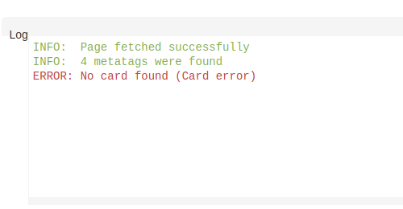

## GatsbyのOGP(Twitter Card)をlocalhostでテスト

<div class="mt-8 mb-8">

<nav class='blog-nav'> 
  <div class='inner'>
    <p>目次</p>
    <ol class="top-ol">
      <li class="top-li">【結論】できませんでした</li>
      <li class="top-li">gatsby-plugin-react-helmetのセットアップ</li>
      <li class="top-li">gatsby-plugin-ngrok-tunnelingのセットアップ</li>
    </ol>
  </div>
</nav>
</div>

<p class="mb-8">
GatsbyのSEO対策としてOGP周り、Twitter Cardを触っていたのですが、ローカルでテストしたくなったので試してみました。
</p>

## 【結論】できませんでした

<p class="mt-8 mb-8">
先に結論を言いますが、私の環境では<strong>できませんでした</strong>。<br/>
期待してここに来た方、すいません。一応何をやったかを記載します。一つ言えるのは、同じことをやっても上手くいかない可能性があります。
</p>

## gatsby-plugin-react-helmetのセットアップ

<p class="mt-8 mb-8">
gatsby-plugin-react-helmet周りを記載します。
</p>

```js:title=seo.tsx
import React from 'react'
import { Helmet } from 'react-helmet'
import { useStaticQuery, graphql } from 'gatsby'
import { FunctionComponent } from 'react'
import { ReactElement } from 'react'
import { useLocation } from '@reach/router'

const querySiteMetadata = graphql`
  query {
    site {
      siteMetadata {
        title
        description
        author
        url
      }
    }
  }
`

interface Meta {
  name: string
  content: string
}

interface SeoProps {
  title: string
  description?: string
  lang?: string
  meta?: Meta[]
  image?: string
}

const SEO: FunctionComponent<SeoProps> = ({
  title,
  description = '',
  lang = 'en',
  meta = [],
  image,
}: SeoProps): ReactElement => {
  const { pathname } = useLocation()
  const { site } = useStaticQuery(querySiteMetadata)

  const siteUrl = `${site.siteMetadata.url}${pathname}`
  const siteImage = `${site.siteMetadata.url}${image || 'site'}`

  console.log(site)
  console.log(siteUrl)

  const metaDescription = description || site.siteMetadata.description

  return (
    <Helmet title="hoge">
      <meta name="twitter:card" content="summary" />
      <meta name="twitter:site" content={`@yasuhiro_it`} />
      <meta property="og:title" content={title} />
      <meta property="og:description" content={metaDescription} />
      <meta property="og:url" content={siteUrl} />
      <meta property="og:type" content="website" />
      <meta property="og:image" content={siteImage} />
    </Helmet>

  )
}

export default SEO

```

```tsx:title=index.tsx
import React from 'react'
import { FunctionComponent } from 'react'
import { ReactElement } from 'react'
import { Link } from 'gatsby'

import SEO from '@/components/seo'

const IndexPage: FunctionComponent = (): ReactElement => (
  <SEO title="Home" />
)

export default IndexPage

```

```js:title=gatsby-config.js
  plugins: [
    `gatsby-plugin-react-helmet`,
    ...
  ]
```

## gatsby-plugin-ngrok-tunnelingのセットアップ

<p class="mt-8 mb-8">
ローカルで開発している環境に対し外部アクセスする方法として、ngrokを使いました。<br/>
</p>

```
yarn add -D gatsby-plugin-ngrok-tunneling
```

<p class="mt-8 mb-8">
あとは、gatsby developで起動すると、
</p>


```bash
success open and validate gatsby-configs - 0.228s
success load plugins - 0.509s
success onPreInit - 0.047s
success initialize cache - 0.007s
success copy gatsby files - 0.061s

      success tunneling available at => https://10e91cd1a02b.ngrok.io
```
<p class="mt-8 mb-8">
<strong>https://10e91cd1a02b.ngrok.io</strong>をTwitterのOGP Validatorに貼り付けます。<br/>
URL: <a ref='https://cards-dev.twitter.com/validator' style='cursor:pointer'>https://cards-dev.twitter.com/validator</a>
</p>


<p class="mt-8 mb-8">
結果が以下です。
</p>



<p class="mt-8 mb-8">
うーん。どうしたらよいのか不明です。
</p>


