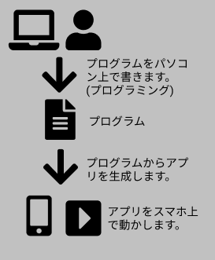

## プログラミングとは？　初心者でも簡単に分かる

<div class="mt-8 mb-8">
<nav class='blog-nav'> 
  <div class='inner'>
    <p>目次</p>
    <ol class="top-ol">
      <li class="top-li">プログラミングは簡単</li>
      <li class="top-li">プログラミングのことを分かりやすく解説</li>
      <li class="top-li">仕事はいくらでもある</li>
      <li class="top-li">どんなメリットがあるのか</li>
      <li class="top-li">とにかくやってみる</li>
    </ol>
  </div>
</nav>
</div>

<p class="mb-16">
学校でプログラミングの授業の必須化、コロナの流行から業務のIT化への対応が叫ばれていることから、プログラミングの需要が一層増えることが予測されます。
</p>
<p class="mb-16">
子供が学習についていけるか心配な方、今からプログラミングを勉強しようかどうか迷っている方向けに、
その不安や疑問を解消していこうと思います。
</p>

## 自己紹介

<p class="mt-8 mb-16">
三流大学卒、プログラミング歴15年の現役プログラマーです。社会人になってから一からプログラミングを学びました。
最初は何から初めて良いかわからず、随分悩みました。
</p>
<p class="mb-16">
そんな私の経験を踏まえて、分かりやすく解説をしていきたいと思います。
</p>

## プログラミングは簡単


<p class="mt-8 mb-16">
はじめに言っておきたいのですが、プログラミングは日本語と比較すると超簡単です。
このブログが読める時点で、あなたはプログラミングを理解するのに必要な知性を備えています。
</p>

### 昔勉強してみたけど、難しくて理解できなかった、という誤解

<p class="mt-8 mb-16">
大抵の場合、呼んだ記事の内容が不親切か自分のレベルに会ってなかったのが原因であることが多いと思います。
正直、私も今だに理解できない書籍やサイトは多数存在します。
</p>
<p class="mb-16">
理解できなかった過去があったとしても、決してあなたのせいではありません。恐れる必要はありません。ご安心ください。
</p>

## プログラミングのことを分かりやすく解説

<p class="mt-8 mb-16">
皆さんが使っているスマホのアプリありますよね？すごく簡単に言ってしまうと、そのアプリを作る行為をプログラミングと呼びます。アプリを作成する流れを図で示すと以下になります。
</p>



<p class="mt-8 mb-16">
プログラムとは、スマホにやって欲しいことが記述された文章です。
</p>
<p class="mb-16">
例えば、子供にお使いに行ってもらう時に、お使いリストを渡すとします。
子供がスマホとするらなば、そのお使いリストがプログラムです。
</p>

### ただし、スマホはおバカちゃんです


<p class="mt-8 mb-16">
スマホというのは、人間と違って、言われたことしかできません。
スマホよりはるかに人間の子供の方が賢いです。
</p>
<p class="mb-16">
プログラムには、スマホに対する指示が記載されており、スマホは指示されたことを黙々と実行します。例えば、
</p>

<div class="mt-8 mb-8">

- 音を出せ
- マイクの音を拾え
- 電話をかけろ
- 画面に画像を表示しろ

</div>

<p class="mb-16">
のような内容です。気を利かせて何かをついでにやってくれる、ということはしません。
というより、できません。そこまで賢くありません。そう考えると、人間って本当に賢いですよね！
</p>

### スマホは難しい言葉は理解できない

<p class="mt-8 mb-16">
さて、先程お使いリストがプログラムだといいました。人間の子供は賢いので、日本語が理解できます。しかし、スマホはバカなので、そんな難しい言葉は理解できません。
</p>
<p class="mb-16">
日本人が日本語を使うように、スマホにはスマホが使う言葉があります。我々はその言葉を、プログラミング言語と呼んでいます。
</p>
<p class="mb-16">
プログラミング言語と聞くと、難しい印象を受けるかもしれませんが、実際は日本語の1万倍簡単な言葉です。プログラミング言語で表現できることは大体、
</p>

<div class="mt-8 mb-8">

- もし〜だったら〜する
- 〜を繰り返す
- 単純な算数
- 同じ処理はどこかにまとめて再利用する

</div>
<p class="mb-16">
です。もちろん実際は他にもいろいろありますが、それでも日本語に比べたら遥かに単純です。
</p>
<p class="mb-16">
イメージがわかない方のために、プログラミング言語の例を載せます。もちろん理解できなくてOKです。
</p>

```
i = x + 2
   
console.log(i)
```

<p class="mt-8 mb-16">
つまりプログラミングとは、おバカなスマホちゃんが理解できる単純な言葉で、1から10全部指示を書き出してあげる行為、
とも言えます。
</p>

## プログラミングなんてできなくても仕事はいくらでもある


<p class="mt-8 mb-8">
プログラミングが簡単とはいいましたが、実際にアプリを作るにはプログラミング以外にも覚えなければいけないことが山ほどあります。
</p>
<p class="mb-16">
例えば会計アプリ作るのに、会計のことがわからなければ、どんなアプリを作ればよいか分からないことでしょう。
</p>
<p class="mb-16">
結局の所、中途半端に首を突っ込むより、その道のプロにお任せするのが一番だと思います。
</p>
<p class="mb-16">
プログラミングができなくても、立派な仕事は世の中に腐るほどあります。
</p>

<div class="mt-8 mb-8">

- 医師
- 弁護士
- 会計士
- 経営

</div>
<p class="mb-16">
などなど。他にもたくさんありますね。
</p>
<p class="mb-16">
ITの活用術の方が、プログラミングよりもよほど役に立つでしょう。例えば、Googleでの検索方法などです。
有益な情報はインターネット上に転がっています。学校で教えるべきはそちらではないかと思っております。
</p>
<p class="mb-16">
私個人の考えとしては、子供がプログラミングの授業に身が入らなくても、実際の社会では全く問題になりません。
それよりも、インターネットでの遊び方を知っている方が、将来役に立つでしょう。
</p>

## プログラミングができるとどんなメリットがあるのか

### 本職でやっていくという方

<div class="mt-8 mb-8">

- 転職しやすい
- 学歴に関係なく、給料アップ狙える
- 収入が安定している

</div>
<p class="mb-16">
私はすでに4度転職経験しており、学歴が高くなく特別な資格がないわりにそこそこ貰っています。
</p>
<p class="mb-16">
私の周りには高卒やそれほど良い大学じゃなくとも、年収1000万超える人たちもちょこちょこいます。
スキルと実績さえあれば、学歴や資格に関係なく稼げる手段だと言えます。
</p>
<p class="mb-16">
それから、IT企業は比較的近年できたということもあり、労働環境が他業種と比べて若干柔軟性はあると思います。
スーツ出勤嫌だとか、体育会系のノリが嫌いな人にはオススメです。
</p>

### 本職でやるつもりはない方

<p class="mt-8 mb-16">
趣味でやるというのであればよいですが、そうでないなら無理して学習する必要はないと思います。
本職でやらないのであれば、ほとんどメリットはありません。
</p>

## プログラミングを学習するなら、とにかくやってみる


<p class="mt-8 mb-16">
学習のスタイルは人によって違います。人によっては最初にがっつり書籍やインターネットで情報収集する人もいるでしょう。
</p>
<p class="mb-16">
しかし、自分で調べたけどプログラミングがいまいち分からない、でも知りたい、という人であるなら深く考えずにとにかくプログラムを書いてみることをオススメします。
</p>
<p class="mb-16">
インターネットにたくさん情報がありますので、最初は自力で情報を集める癖をつけるのがよいです。
お金をかけずに学習する方法や、より具体的な学習方法は別の記事に書いていきたいと思います。
</p>


